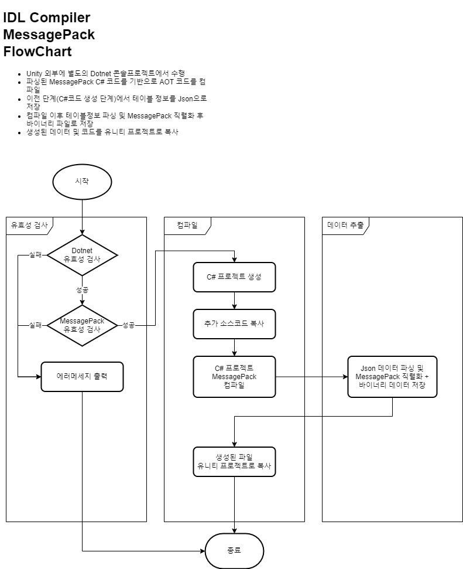

# 데이터 직렬화 (Data Serializer)
- [데이터 직렬화 (Data Serializer)](#데이터-직렬화-data-serializer)
	- [개요](#개요)
	- [기능](#기능)
		- [데이터 변환](#데이터-변환)
		- [데이터 사용](#데이터-사용)
	- [Data Serializer 구조](#data-serializer-구조)
		- [모듈 설명](#모듈-설명)
		- [모듈 구조](#모듈-구조)
			- [Excel Parser](#excel-parser)
			- [IDL Generator](#idl-generator)
			- [IDL Compiler](#idl-compiler)
		- [지원 데이터 타입](#지원-데이터-타입)
	- [데이터 변환 예시](#데이터-변환-예시)
		- [변환 과정](#변환-과정)
			- [원본 데이터 (Google Spreadsheet)](#원본-데이터-google-spreadsheet)
			- [CSV](#csv)
			- [IDL (MessagePack)](#idl-messagepack)
		- [데이터 로드](#데이터-로드)
	- [용어 정리](#용어-정리)
		- [Serialization](#serialization)
		- [IDL (인터페이스 정의 언어)](#idl-인터페이스-정의-언어)
		- [AOT / JIT](#aot--jit)
		- [AOT 코드 생성](#aot-코드-생성)

## 개요
기획데이터를 직렬화 하고 런타임에 로드할 수 있도록 변환 해 주는 도구.  
원본 데이터(CSV)로부터 MessagePack 변환을 지원하고, 런타임에 로드할 수 있는 랩핑 코드 생성

## 기능
### 데이터 변환
- CSV &rarr; MessagePack 바이너리 변환  
CSV 파일로 부터 스키마를 해석, IDL 코드를 생성하고 이를 기반으로 데이터 객체 생성 및 바이너리 파일로 추출하는 과정을 자동화 합니다.
- CodeDOM을 사용한 IDL 코드 생성  
.NET CodeDOM을 활용한 코드생성으로 자동생성 코드의 구조 변경시 유연하게 대응할 수 있습니다.
- Primary 키 사용 여부에 따른 테이블 구조 (Dictionary / List) 지원  
데이터 유형에 따라 테이블의 각 원소를 Key/Value 또는 리스트로 접근할 수 있도록 선택이 가능합니다.
- 서버전용 테이블 분리 생성  
민감한 자료에 대해 서버에서만 사용할 수 있는 필드에 대한 스키마를 지정하고, 이를 감지하여 서버테이블용 C# 코드 및 데이터를 별도로 추출합니다.
- 기획데이터 병합 지원  
동일한 스키마의 테이블을 여러 파일로 분산 관리하고 이를 변환할 때 병합해서 사용할 수 있도록 데이터 병합을 지원합니다.
### 데이터 사용
- 런타임 테이블 로드 API 제공  
추출된 바이너리 데이터를 런타임에 로드할 수 있는 로더를 제공합니다.
## Data Serializer 구조

### 모듈 설명
이름 | 기능 | 비고
--- | --- | ---
ExcelParser | Excel 데이터를 SheetInfo로 변환 | SheetInfo 데이터는 내부적으로 정한 형식으로 구성됨
IDL Generator | SheetInfo 데이터를 IDL로 변환 | MessagePack C# 클래스
IDL Compiler | IDL 데이터를 AOT 코드로 변환 | 외부 컴파일러를 호출하여 데이터 바인딩을 위한 AOT 코드 생성
DataParser | SheetInfo 데이터를 IDL코드로 파싱하여 직렬화된 데이터를 생성 | 필요에 따라 AOT 코드로 직렬화를 할 수도 있음
### 모듈 구조
#### Excel Parser

#### IDL Generator

#### IDL Compiler


### 지원 데이터 타입
- C# 타입 (기본형, 사용자정의 Enum, 배열)
- Unity 타입 (Vector, Matrix4x4, Quaternion, Rect, Bounds)
## 데이터 변환 예시
### 변환 과정
1. 원본 데이터로부터 CSV 파일 다운로드
2. 데이터 직렬화 툴로 변환
3. 런타임에 데이터 로드

#### 원본 데이터 (Google Spreadsheet)


#### CSV
``` csv
Primary/int,string,int
ID,Name,Age
1,John,20
2,Dave,24
3,Jack,32
4,Paul,23
5,Mike,35
```
#### IDL (MessagePack)
``` csharp
/* <auto-generated>
    MessagePack Object Code
</auto-generated> */
using System;
using MessagePack;
using System.Collections.Generic;
using System.Linq;
using UnityEngine;

namespace Data
{
	[MessagePackObject]
	public class SampleData
	{
		[Key(0)]
		public int ID;
		[Key(1)]
		public string Name;
		[Key(2)]
		public int Age;
	}
	
	[MessagePackObject]
	public sealed partial class TableSampleData : Loader<TableSampleData>
	{
		[Key(0)]
		public Dictionary<int, SampleData> Datas = new();
		
		public byte[] ExportData()
		{
			var bytes = MessagePackSerializer.Serialize(this);
			return bytes;
		}
	}
}
```
### 데이터 로드
``` csharp
async UniTask LoadTestAsync()
{
    var table = await TableSampleData.LoadAsync("SampleData.bytes");
    var row = table.Datas[1]; // { "ID": 1, "Name": "John", "Age": 20 }
}
```
## 용어 정리
### Serialization
- 데이터 구조나 오브젝트 상태를 동일하거나 다른 컴퓨터 환경에 저장하고 나중에 재구성할 수 있는 포멧으로 변환하는 과정 ([위키백과](https://ko.wikipedia.org/wiki/%EC%A7%81%EB%A0%AC%ED%99%94))
### IDL (인터페이스 정의 언어)
- 어느 한 언어에 국한되지 않는 언어중립적인 방법으로 인터페이스를 표현, 같은 언어를 사용하지 않는 소프트웨어 컴포넌트 사이의 통신을 가능하게 한다 ([위키백과](https://ko.wikipedia.org/wiki/%EC%9D%B8%ED%84%B0%ED%8E%98%EC%9D%B4%EC%8A%A4_%EC%A0%95%EC%9D%98_%EC%96%B8%EC%96%B4))
- MessagePack에서는 MessagePackObject 특성으로 지정된 클래스가 IDL의 역할을 하고 있어 편의상 IDL로 사용
	``` csharp
	namespace Metaverse.Data
	{
		[MessagePackObject]
		public class PropInfo
		{
			[Key(0)]
			public int ID;
			[Key(1)]
			public string Name;
			[Key(2)]
			public string ResourcePath;
		}
	}
	```
### AOT / JIT
- AOT (ahead-of-time) 컴파일 : 모든 코드가 미리 컴파일되어있어야함
- JIT (just-in-time) 컴파일 : 런타임 코드생성이 가능
### AOT 코드 생성
- 특정 플랫폼 및 IL2CPP 환경에서 JIT 컴파일이 허용되지 않음
- 직렬화 라이브러리에서 런타임에 Reflection을 통한 타입추론을 하고있으나 이를 사용할 수 없음 (Reflection의 일부 기능은 JIT 컴파일로 동작)
- 직렬화 라이브러리에서 제공하는 AOT 코드 생성기를 통해 데이터 구조가 어떤 타입을 멤버로 두는지 미리 컴파일
