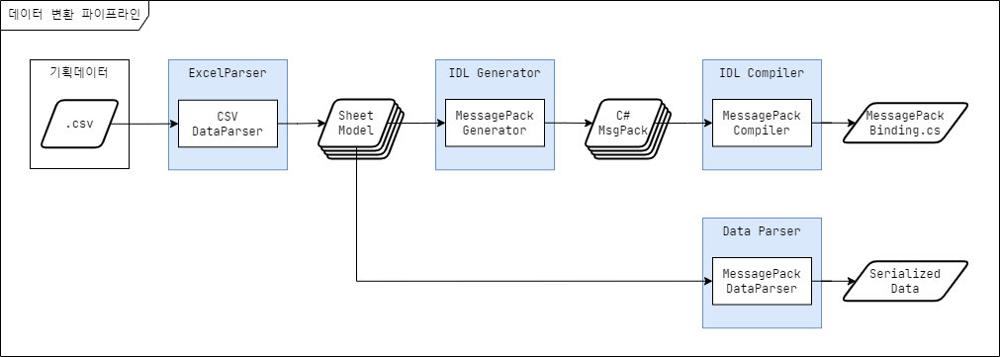
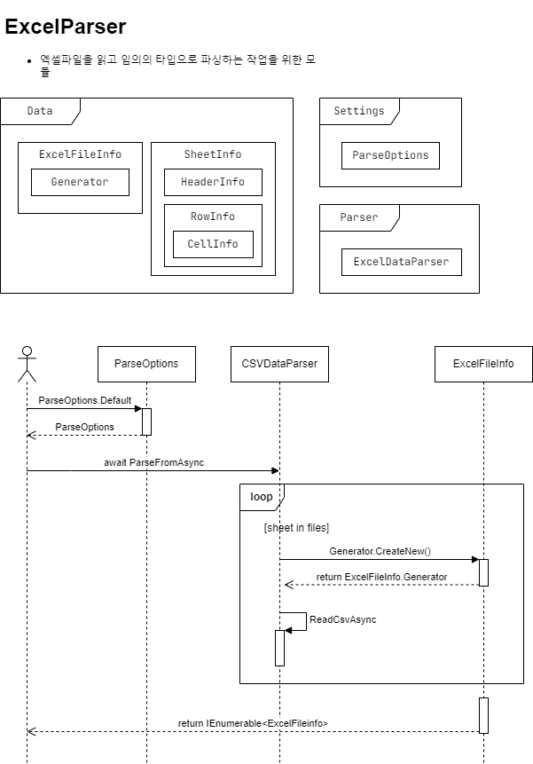
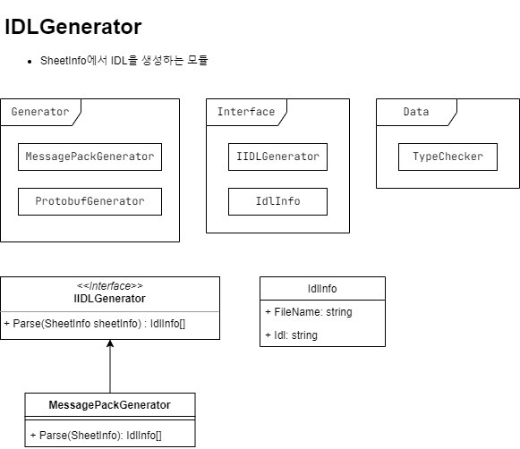
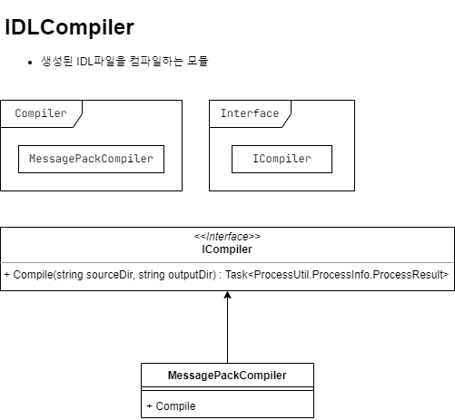
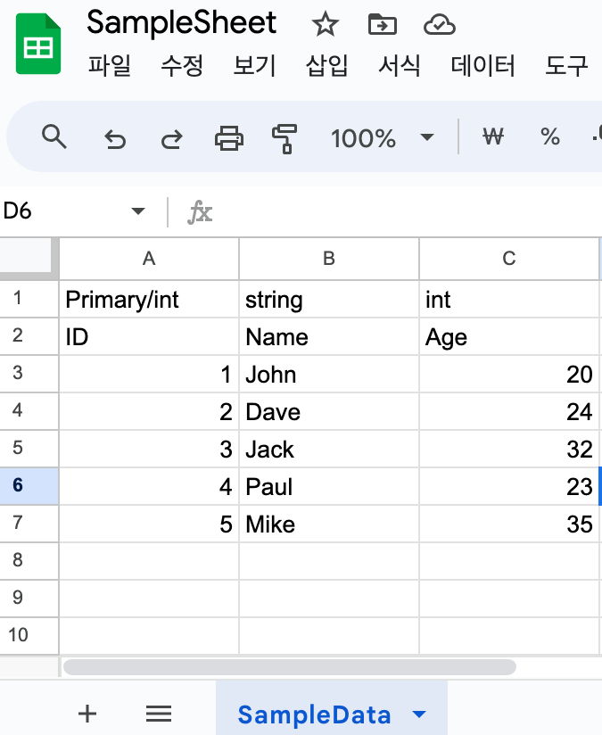

# 데이터 직렬화 (Data Serializer)
## 개요
기획데이터를 직렬화 하고 런타임에 로드할 수 있도록 변환 해 주는 도구.  
원본 데이터(CSV)로부터 MessagePack 변환을 지원하고, 런타임에 로드할 수 있는 랩핑 코드 생성

## 기능
- CSV &rarr; MessagePack 바이너리 변환
- Primary 키 사용 여부에 따른 테이블 구조 (Dictionary / List) 지원
- 런타임 테이블 로드 API 제공
- 서버전용 테이블 분리 생성
- 기획데이터 병합 지원
- CodeDOM을 사용한 IDL 생성
## Data Serializer 구조

### 모듈 설명
이름 | 기능 | 비고
--- | --- | ---
ExcelParser | Excel 데이터를 SheetInfo로 변환 | SheetInfo 데이터는 내부적으로 정한 형식으로 구성됨
IDL Generator | SheetInfo 데이터를 IDL로 변환 | MessagePack C# 클래스
IDL Compiler | IDL 데이터를 AOT 코드로 변환 | 외부 컴파일러를 호출하여 데이터 바인딩을 위한 AOT 코드 생성
DataParser | SheetInfo 데이터를 IDL코드로 파싱하여 직렬화된 데이터를 생성 | 필요에 따라 AOT 코드로 직렬화를 할 수도 있음
### 모듈 구조



### 지원 데이터 타입
- C# 타입 (기본형, 사용자정의 Enum, 배열)
- Unity 타입 (Vector, Matrix4x4, Quaternion, Rect, Bounds)
## 데이터 변환 예시
### 변환 과정
1. 원본 데이터로부터 CSV 파일 다운로드
2. 데이터 직렬화 툴로 변환
3. 런타임에 데이터 로드

#### 원본 데이터 (Google Spreadsheet)


#### CSV
``` csv
Primary/int,string,int
ID,Name,Age
1,John,20
2,Dave,24
3,Jack,32
4,Paul,23
5,Mike,35
```
#### IDL (MessagePack)
``` csharp
/* <auto-generated>
    MessagePack Object Code
</auto-generated> */
using System;
using MessagePack;
using System.Collections.Generic;
using System.Linq;
using UnityEngine;

namespace Data
{
	[MessagePackObject]
	public class SampleData
	{
		[Key(0)]
		public int ID;
		[Key(1)]
		public string Name;
		[Key(2)]
		public int Age;
	}
	
	[MessagePackObject]
	public sealed partial class TableSampleData : Loader<TableSampleData>
	{
		[Key(0)]
		public Dictionary<int, SampleData> Datas = new();
		
		public byte[] ExportData()
		{
			var bytes = MessagePackSerializer.Serialize(this);
			return bytes;
		}
	}
}
```
### 데이터 로드
``` csharp
async UniTask LoadTestAsync()
{
    var table = await TableSampleData.LoadAsync("SampleData.bytes");
    var row = table.Datas[1]; // { "ID": 1, "Name": "John", "Age": 20 }
}
```