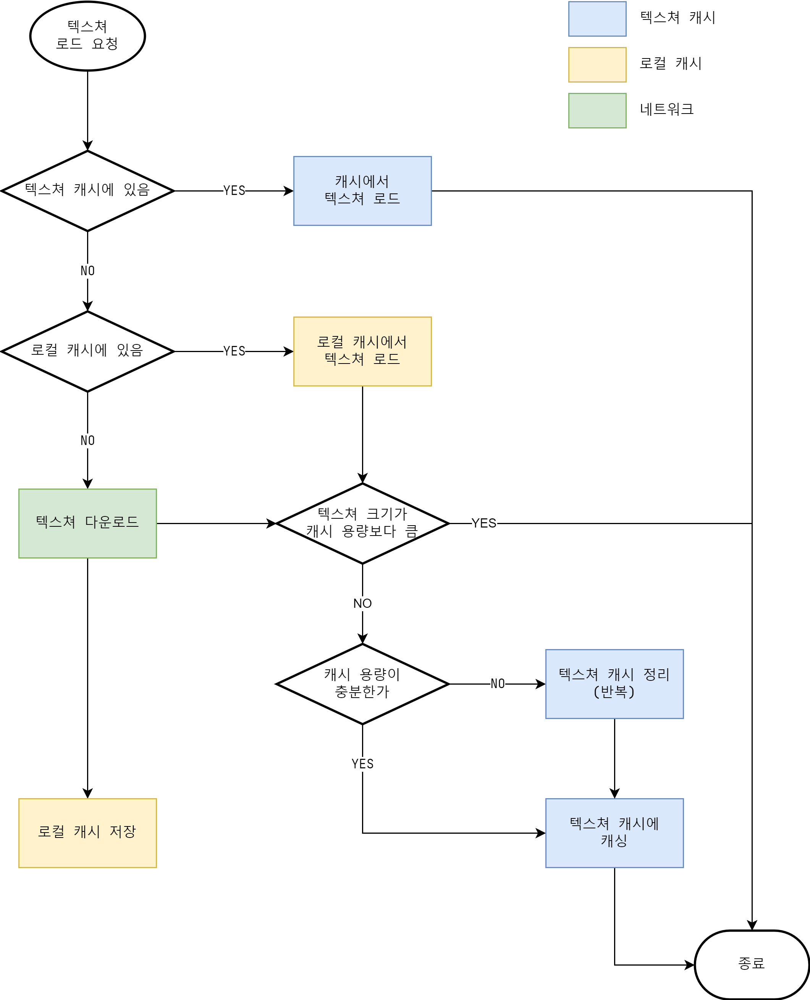

# 로컬 캐시
- [로컬 캐시](#로컬-캐시)
  - [개요](#개요)
  - [기능](#기능)
    - [캐시 로드](#캐시-로드)
    - [관리](#관리)
  - [API](#api)
    - [Static API](#static-api)
    - [eCacheType](#ecachetype)
    - [Request API](#request-api)
    - [Callbacks](#callbacks)
      - [Delegates](#delegates)
      - [Callbacks](#callbacks-1)
  - [사용 예시](#사용-예시)
  - [텍스쳐 캐시 연동](#텍스쳐-캐시-연동)

## 개요
다운로드 받은 파일을 클라이언트 장비에 임시로 캐싱

## 기능
### 캐시 로드
- bytes[] 및 Texture2D 로드 지원  
캐싱된 파일을 byte 배열로 읽도록 하거나 Unity Texture2D로 변환해서 직접 사용할 수 있도록 합니다.
### 관리
- 동일 URL에 다운로드 요청 시, 한 번만 다운로드 하도록 처리  
다운로드 요청 URL과 동일한 주소의 다운로드가 진행중일 경우 다운로드 결과를 응답받는 이벤트를 등록하고, 기존 다운로드 완료시 이벤트를 호출합니다. (동일 다운로드 요청에 대한 우회처리)
- 동시 다운로드 제한  
한 번에 동시에 진행되는 다운로드의 수를 제한하고 초과되는 요청은 큐로 관리됩니다.
- 캐시파일 관리 및 무결성 검사  
다운로드 URL 및 저장된 파일의 크기를 별도로 관리하고 실제 캐싱된 파일과 일치하는지 검사합니다.  
무결성을 통과하지 못 하는 경우 캐싱된 파일을 삭제하고 새로 다운로드 받습니다.
- 메모리 관리 (C# ArrayPool 사용)  
캐시 파일을 위한 메모리 할당 대신 .NET ArrayPool을 통해 관리합니다.
## API
소스코드 전문을 공개할 수 없어 작성된 Public API로 내용을 대체합니다.

### Static API

API | 용도
--- | ---
UniTask<byte[]> **LoadBytesAsync**(string fileName, string url, LoadCacheCallbacks loadCacheCb, DownloadCallbacks downloadCb, DownloadRequestCallbacks downloadReqCb) | 비동기 다운로드 (byte[])
UniTask<Texture2D> **LoadTexture2DAsync**(string fileName, string url) | 비동기 다운로드 (Texture2D)
void **PurgeCache**(string fileName) | 캐시 삭제
void **PurgeCache**(eCacheType type) | eCacheType 내 캐시 모두 삭제
void **DeleteAllCache**() | 모든 캐시 삭제
void **PurgeTemp**(string fileName) | 임시 파일 삭제
void **PurgeTemp**(eCacheType type) | eCacheType 내 임시 파일 모두 삭제
void **DeleteAllTemp**() | 모든 임시파일 삭제
void **SetCacheType**(eCacheType type) | 캐시 타입 선택
void **PrintInfo**() | 캐시 정보 출력

### eCacheType
이름 | 종류
--- | ---
DEFAULT | 기본 캐시 타입

### Request API

API | 용도
--- | ---
Request **NewRequest**(string fileName, string url) | 새로운 다운로드 요청을 위한 Request 생성 (static)
Request **WithLoadCacheCallbacks**(LoadCacheCallbacks cb) | 캐시 로드 콜백 등록
Request **WithDownloadCallbacks**(DownloadCallbacks cb) | 다운로드 콜백 등록
Request **WithDownloadRequestCallbacks**(DownloadRequestCallbacks cb) | 다운로드 요청 콜백 등록
UniTask<byte[]> **LoadBytesAsync**() | 비동기 다운로드 (byte[])
UniTask<Texture2D> **LoadTexture2DAsync**() | 비동기 다운로드 (Texture2D)

### Callbacks

#### Delegates
이름 | 파라미터 설명
--- | ---
void **OnProgress**(int currentRead, long totalRead, long totalSize) | currentRead : 현재 읽은 데이터 (bytes)<br>totalRead : 총 읽은 데이터 (bytes)<br>totalSize : 총 파일 크기 (bytes)
void **OnHttpStatus**(HttpStatusCode statusCode) | statusCode : HttpResponse 상태 코드
void **OnDownloadComplete**(string hash, long totalSize) | hash : 다운로드 받은 파일의 해시값 (0이면 해시가 유효하지 않음)<br>totalSize : 총 파일 크기 (bytes)
void **OnLoadComplete**(bool success, long totalSize, Memory<byte> bytes) | success : 성공/실패<br> totalSize : 총 파일 크기 (bytes)<br>bytes : 데이터 (bytes)
void **OnDownloadHandler**(DownloadHandler handler) | handler : 다운로드 제어, 상태 확인 등을 위한 클래스<br>(LocalCache.DownloadHandler)
void **OnDownloadRequest**(DownloadRequest request) | request : 요청 큐로 전달된 다운로드 요청 상태에 대한 모니터링 클래스<br>(LocalCache.DownloadRequest)

#### Callbacks
이름 | 설명
--- | ---
OnProgress | 로컬 캐시 파일 로드 진행 상황
OnLoadComplete | 로컬 캐시 파일 로드 완료
OnProgress | 다운로드 진행 상황
OnHttpStatus(OnFailed) | 다운로드 실패
OnDownloadComplete | 다운로드 성공
OnDownloadHandler | 다운로드 제어
OnDownloadRequest | 다운로드 요청

## 사용 예시
``` csharp
// 비동기 bytes 로드
var bytes = await Cache.LoadBytesAsync(_fileName, _url);
if (bytes != null)
{
    var tex = new Texture2D(1, 1);
    tex.LoadImage(bytes);
}

// 비동기 Texture2D 로드
var tex = await Cache.LoadTexture2DAsync(_fileName, _url); // tex : Texture2D
_image.texture = tex;

// Request 로드 Texture2D
var loadCacheCallbacks = new Callbacks.LoadCacheCallbacks
{
    OnProgress = OnCacheLoadProgress,
    OnLoadComplete = OnCacheLoadComplete,
};

var downloadCallbacks = new Callbacks.DownloadCallbacks
{
    OnProgress = OnDownloadProgress,
    OnFailed = OnFailed,
    OnDownloadComplete = OnDownloadComplete,
    OnDownloadHandler = OnDownloadHandler
};

var downloadRequestCallbacks = new Callbacks.DownloadRequestCallbacks
{
    OnDownloadRequest = OnDownloadRequest,
};

var tex= await Cache.Request.NewRequest(_fileName, _url)
        .WithLoadCacheCallbacks(loadCacheCallbacks)
        .WithDownloadCallbacks(downloadCallbacks)
        .WithDownloadRequestCallbacks(downloadRequestCallbacks)
        .LoadTexture2DAsync();
_image.texture = tex;
```

## 텍스쳐 캐시 연동
텍스쳐 캐시 기능의 일부로 로컬캐시를 사용

