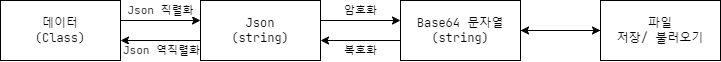

# 로컬 세이브
- [로컬 세이브](#로컬-세이브)
  - [개요](#개요)
  - [기능](#기능)
    - [관리](#관리)
    - [보안](#보안)
  - [구조](#구조)
  - [API](#api)
    - [Global](#global)
    - [Temp, Persistent](#temp-persistent)
      - [Load (동기)](#load-동기)
      - [Load (비동기)](#load-비동기)
      - [Save (동기)](#save-동기)
      - [Save (비동기)](#save-비동기)
      - [Delete](#delete)
  - [사용 예시](#사용-예시)

## 개요
데이터를 스토리지에 저장하기 위한 유틸리티
## 기능
### 관리
- string Key를 통한 세이브 데이터 관리  
세이브 시 지정된 Key별로 세이브 파일을 생성/관리 합니다.
- 세이브 파일 핸들러 관리  
런타임에 사용중인 세이브 파일의 핸들러를 관리하여 외부 접근을 차단합니다.
- 사용자 ID별 세이브 영역 분리  
사용자에 따라서 세이브 파일을 동일한 세이브 파일이라도 
- 저장할 타입에 따른 분리  
임시 또는 영구적으로 저장하도록 로컬 세이브 옵션이 제공됩니다.
### 보안
- 세이브 데이터 암/복호화 지원

## 구조


## API
소스코드 전문을 공개할 수 없어 작성된 Public API로 내용을 대체합니다.

### Global
API | 용도 | 비고
--- | --- | ---
void SetId(string id) | 사용자 ID 세팅 | Temp, Persistent만 적용
void ClearId() | ID 초기화 | Temp, Persistent만 적용

### Temp, Persistent
API | 용도 | 비고
--- | --- | ---
string GetPath(string key) | 로컬 세이브 파일의 실제 경로 조회 |
bool IsExist(string key) |로컬 세이브가 있는지 확인 |

#### Load (동기)
메인 스레드를 점유. 가급적 비동기 API 사용을 권장
API | 
--- | 
T **LoadJson**<T>(string key)
string **LoadString**(string key)
int **LoadInt**(string key)
float **LoadFloat**(string key)

#### Load (비동기)
async/await 방식 또는 onLoaded 콜백 방식 사용
API |
--- |
UniTask<T> **LoadJsonAsync**<T>(string key, Action<T> onLoaded)
UniTask<string> **LoadStringAsync**(string key, Action<string> onLoaded)
UniTask<int> **LoadIntAsync**(string key, Action<int> onLoaded)
UniTask<float> **LoadFloatAsync**(string key, Action<float> onLoaded)

#### Save (동기)
저장하려는 파일이 사용 중이면 false 리턴 (false : 저장되지 않음)
API |
--- |
bool **SaveJson**<T>(string key, T data) where T : class
bool **SaveString**(string key, string data)
bool **SaveInt**(string key, int data)
bool **SaveFloat**(string key, float data)

#### Save (비동기)
저장하려는 파일이 사용 중이면 대기 후 사용 가능할 때 저장 요청
API |
--- |
UniTask **SaveJsonAsync**<T>(string key, T data) where T : class
UniTask **SaveStringAsync**(string key, string data)
UniTask **SaveIntAsync**(string key, int data)
UniTask **SaveFloatAsync**(string key, float data)
#### Delete
API | 비고
--- | ---
void **Delete**(string key)
async UniTask<bool> **DeleteAsync**(string key) | 비동기 삭제<br>(true : 삭제 성공, false : 실패)

## 사용 예시
``` csharp
private static readonly string SaveKey = "LocalSaveTestKey";

[Serializable]
public class UserData
{
    [JsonProperty("name")]
    public string Name;
    
    [JsonProperty("age")]
    public int Age;
}

// 동기
void LocalSaveTest() 
{
    var userData = new UserData
    {
        Name = "John",
        Age = 20,
    };
    
    var success = LocalSave.Temp.SaveJson(SaveKey, userData);
    if (success)
    {
        var savedUserData = LocalSave.Temp.LoadJson<UserData>(SaveKey);
    }
}

// 비동기
async UniTask LocalSaveTestAsync() 
{
    var userData = new UserData
    {
        Name = "John",
        Age = 20,
    };

    // Save
    await LocalSave.Temp.SaveJsonAsync(SaveKey, userData);
    // Load
    var savedUserData = await LocalSave.Temp.LoadJsonAsync<UserData>(SaveKey);
}
```