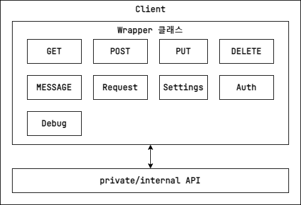

# REST API 헬퍼
- [REST API 헬퍼](#rest-api-헬퍼)
  - [개요](#개요)
  - [기능](#기능)
  - [구조](#구조)
  - [사용 예시](#사용-예시)

## 개요
C# HttpClient을 통해 REAT API 호출을 처리하는 헬퍼 라이브러리

## 기능
- .NET HttpClient를 래핑한 클래스 구성  
REST API 요청을 단일 객체로 처리/관리 합니다.
- 자주 사용하는 REST API에 대한 랩핑 클래스 제공  
GET, POST, PUT, DELETE 요청에 대한 간단한 요청을 할 수 있는 랩핑 클래스를 제공합니다.  
- 상세한 요청에 대한 구성 제공  
요청 할 내용의 Content, ContentType 등을 지정할 수 있는 HttpRequestBuilder를 제공합니다.
- 요청의 경량화 및 결과를 스트림으로 수신  
모든 네트워크 요청은 Header를 우선적으로 요청하고 Body의 내용은 스트림으로 수신하고 이 때, 일정 크기의 버퍼만큼 나누어 수신합니다.
## 구조


## 사용 예시
소스코드 전문을 공개할 수 없어 사용 예시로 내용을 대체합니다.

``` csharp
// (GET, POST, PUT, DELETE)
async UniTask SimpleRequestAsync() 
{
    var url = "...";
    var content = "...";
    
    var resultStr = await Client.GET.RequestStringAsync(Url);
    await Client.POST.RequestStringAsync(Url, Content);
    await Client.PUT.RequestStringAsync(Url, Content);
    await Client.DELETE.RequestStringAsync(Url);
}

// HttpRequestMessage
// 1. HttpRequestBuilder.CreateNew
async UniTask SimpleMessageRequest_BuillderAsync()
{
    var url = "...";
    var content = "...";
    var headerKey = "...";
    var headerValue = "...";
    var contentType = "...";
    
    var builder = HttpRequestBuilder.CreateNew(Client.eRequestType.POST, url);
    builder.SetContent(content);
    builder.AddHeader(headerKey, headerValue);
    builder.SetContentType(contentType);
    
    var responseJson = await Client.MESSAGE.RequestStringAsync(builder.Request);
}

// 2. HttpRequestBuilder.Generate
async UniTask SimpleMessageRequest_Builder_AllInOneAsync()
{
    var url = "...";
    var content = "...";
    var headerKey = "..."; var headerValue = "..."; var contentType = "...";
    var request = HttpRequestBuilder.Generate(new HttpRequestMessageInfo 
    {
        RequestMethod = Client.eRequestType.POST, Url = PapagoApiUrl,
        Content = new StringContent(content),
        Headers = new (string, string)[]
        {
            (headerKey, headerValue),
        },
        ContentType = contentType,
    });
    var responseJson = await Client.MESSAGE.RequestStringAsync(request);
}
```